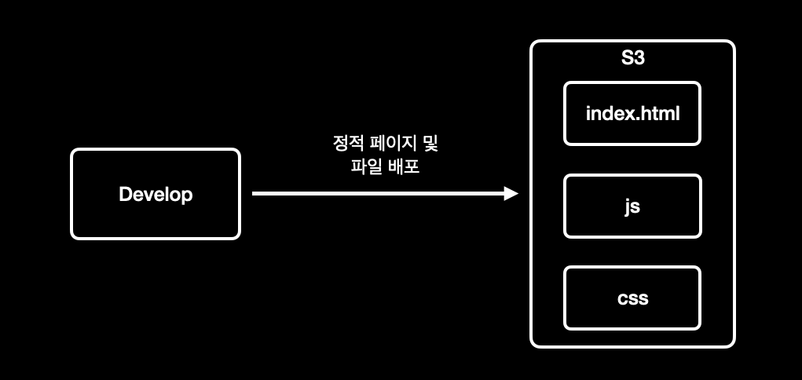
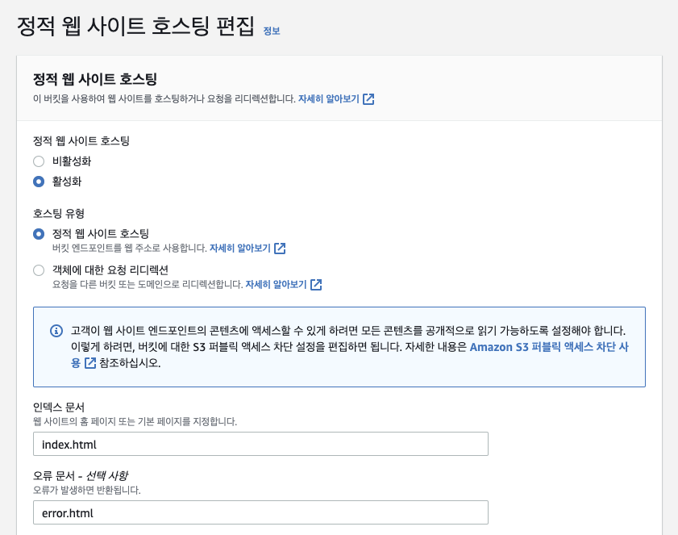
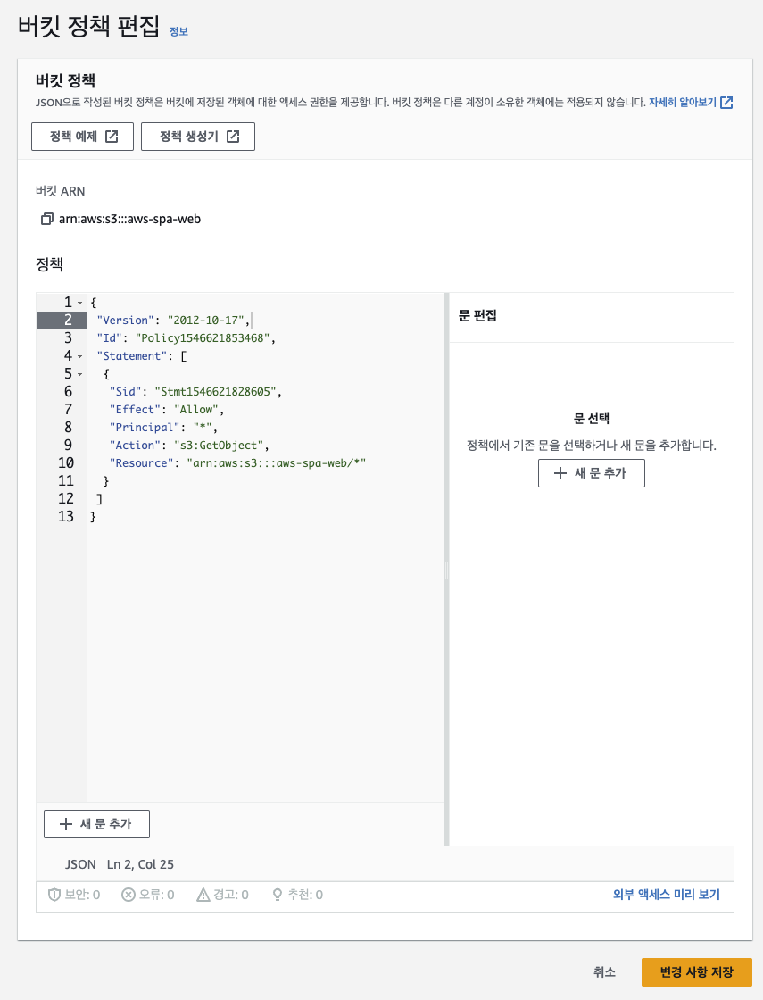
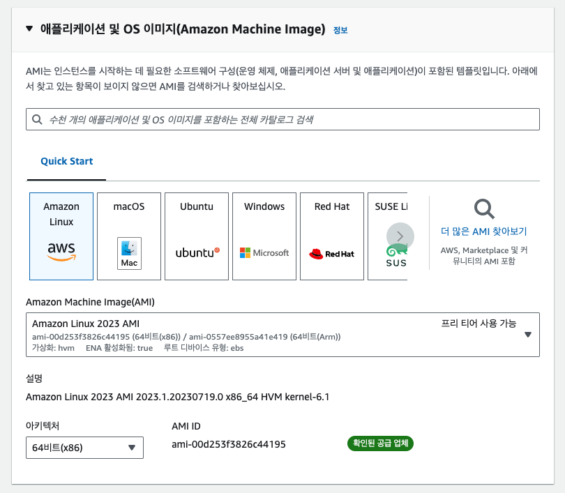

## 애플리케이션 흐름도

  

<br><br>

## S3 정적 웹 사이트 호스팅 배포

### AWS S3 - Amazon Simple Storage Service

- 아마존 웹 서비스에서 제공하는 온라인 스토리지 웹 서비스
- 정적 웹 사이트 호스팅을 제공

### S3 정적 웹 사이트 호스팅 배포 (Vue 배포)



1. 프로젝트 빌드

    ```java
    npm run build
    ```

   

   dist 폴더에 빌드된 파일들이 생성됨

2. S3 버킷 생성

   
    
   외부에서 접속하는 모든 사용자에게 페이지를 제공하기 위해 모든 퍼블릭 엑세스 차단을 체크 해제한다.

3. 웹 호스팅 설정
    - 버킷 - 속성 - 정적 웹 사이트 호스팅

      

4. 버킷 정책 편집

   

5. 버킷에 빌드된 파일들을 업로드

   

6. 웹 호스팅 확인
    - 버킷 웹 사이트 엔드포인트 url 주소로 요청

      

<br><br>

## EC2 서버 배포

### AWS EC2 - Amazon Elastic Compute Cloud

- 사용자가 아마존 머신 이미지(AMI)로 부팅하여 아마존이 "인스턴스"라 부르는 가상 머신을, 원하는 소프트웨어를 포함하여 구성할 수 있게 하는 웹 서비스를 제공

### EC2 서버 배포


1. 프로젝트를 Github 에 Push
2. 키 페어 생성
   1. ec2 인스턴스에 SSH 로 연결할 때 사용할 키 페어 생성
   2. ec2 - 네트워크 및 보안 - 키페어 - 키 페어 생성

      

      - 키 페어를 생성하면 프라이빗 키 파일을 다운받게 된다.
3. 네트워크 보안 그룹 생성
   1. ec2 - 네트워크 및 보안 - 보안 그룹 - 보안 그룹 생성

      

      - 인바운트 규칙 설정시 두 개의 포트를 허용한다.
         - SSH 연결을 통해 인스턴스에 접근하기 위한 포트
         - 인스턴스에서 실행할 웹 서버에 접근하기 위한 포트
4. EC2 인스턴스 생성
   1. 이름 및 태그 설정

      

   2. AMI 선택

      

   3. 인스턴스 유형 선택

      

   4. 키 페어, 네트워크 설정

      

      - 앞에서 미리 생성한 키 페어와 보안 그룹 사용
   5. 스토리지 구성

      

   6. 탄력적 IP 설정

      

   7. 탄력적 IP 를 인스턴스에 매핑

      

      - 연결할 인스턴스에 위에서 생성한 인스턴스를 지정
5. 인스턴스에 SSH 접속
   1. 키 페어 생성시 다운받은 프라이빗 키 파일의 권한을 변경한다.

       ```bash
       
       // 프라이빗 키 파일의 사용 권한을 유저에게만 읽기 권한을 부여
       chmod 400 [프라이빗 키 파일]
       ```

   2. 프라이빗 키 파일을 사용하여 인스턴스에 접속

       ```bash
       ssh -i [프라이빗 키 파일] ec2-user@[퍼블릭 DNS]
       ```

6. 인스턴스에 git, jdk 설치
   1. jdk 설치

       ```bash
       sudo yum install [jdk]
       # sudo yum install java-17-amazon-corretto
       ```

   2. git 설치

       ```bash
       sudo yum install git
       ```

7. 프로젝트 git clone
   1. 프로젝트를 받을 디렉토리를 생성 후 해당 디렉토리에 git clone 을 통해 프로젝트를 받는다.

       ```bash
       git clone [원격 저장소 주소]
       ```

8. 배포 관리를 위한 스크립트 작성
   1. 스크립트를 통해 다음 과정을 수행한다.
      - 업데이트 된 프로젝트를 Git 으로부터 pull
      - 업데이트 된 프로젝트를 빌드
      - 기존에 빌드된 파일로 실행되고 있는 서비스를 종료
      - 새로 빌드된 파일로 서비스 실행

       ```bash
       #!/bin/bash
       
       REPO=프로젝트가 위치한 절대경로. 프로젝트의 상위 경로
       PROJECT=프로젝트 폴더명
       CLIENT_URL=S3 웹호스팅 주소
       
       # git 에서 clone 받은 프로젝트로 이동
       cd $REPO/$PROJECT/
       
       # git 에서 프로젝트의 최신 상태를 pull
       git pull
       
       # 프로젝트 빌드. jar 파일 생성
       ./gradlew build -x test
       
       # 프로젝트의 상위 경로로 이동
       cd $REPO
       
       # 빌드된 jar 파일을 프로젝트의 상위 경로 위치에 복사
       cp $REPO/$PROJECT/build/libs/*.jar $REPO/
      
       # plain 파일 제거
       rm $REPO/*-plain.jar
       
       # 이전에 빌드된 파일로 실행중인 PID 값
       CURRENT_PID=$(pgrep -f ${PROJECT}.*.jar)
       
       # 이전에 빌드된 파일로 실행중인 애플리케이션 종료
       if [ -z "$CURRENT_PID" ]; then
               echo "> 실행 중인 애플리케이션이 존재하지 않습니다."
       else
               kill -15 $CURRENT_PID
               sleep 5
       fi
       
       # 새로 생성된 jar 파일명
       JAR_NAME=$(ls -tr $REPO/ | grep jar | tail -n 1)
       
       # jar 파일로 애플리케이션 실행. nohup 명령어를 통해 터미널 접속을 종료해도 애플리케이션이 종료되지 않도록 함
       nohup java -DclientUrl=$CLIENT_URL -jar $REPO/$JAR_NAME 2>&1 &
       ```

   2. 스크립트 파일에 실행 권한 추가
